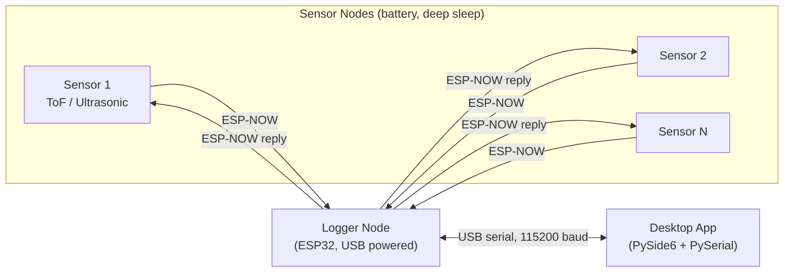

# Stock Checker

Battery-powered ESP-NOW sensor nodes report material stock level to a logger node, which relays readings and time sync to a PC desktop app over serial.

## Overview

Stock bins need to report "how full am I" without wiring every bin for power or network, and without manual checks. Each bin gets a battery sensor node that measures distance to material and reports it wirelessly.

**Why ESP-NOW** sensor nodes spend nearly all their time in deep sleep and wake only to send one small packet. WiFi/BLE both require an association or connection handshake on every wake — wasted time and power for something about to sleep again. ESP-NOW sends directly to a peer MAC with no AP, no pairing, no persistent connection state — a good fit for a fixed, small set of peers waking briefly on a schedule.

## System Architecture



## Hardware

| Component | Sensor node | Logger node |
|---|---|---|
| MCU | ESP32 (Xtensa) | ESP32 (Xtensa) |
| Power | Battery | USB |
| Distance sensor | VL53L1X ToF (I2C: SDA `GPIO13`, SCL `GPIO14`) **or** HC-SR04 ultrasonic (`TRIG GPIO25`, `ECHO GPIO26`) — compile-time choice | none |
| Stock indicator | LED on `GPIO33`, state held through deep sleep via `gpio_hold_en` | none |
| Host link | none | USB-serial UART0, 115200 baud |
| Radio | 802.11 ESP-NOW, TX power capped ~10 dBm | 802.11 ESP-NOW, TX power capped ~10 dBm |

## Repository Structure

```
sensor_node/                     ESP-IDF project, battery node firmware
├── main/
│   ├── sensor_node.c            app_main: read sensor, send, sleep
│   ├── sensor_select.h          compile-time ToF vs. ultrasonic switch
│   └── provisioning.c/.h        NVS-backed interval persistence
└── components/
    ├── tof_sensor/               VL53L1X driver + wrapper
    ├── ultrasonic_sensor/        HC-SR04 driver + wrapper
    ├── led/                      stock LED, deep-sleep GPIO hold
    └── espnow_comm/              send reading, listen for reply, provisioning

logger_node/                     ESP-IDF project, always-on relay/hub
├── main/logger_node.c           app_main: init, wait for time sync, run
└── components/
    ├── espnow_comm/              peer table, drift calc, FreeRTOS rx queue
    └── pc_comm/                  UART command parser (SETTIME/SETFREQ/...)

pc/                               Desktop app (Python)
├── main.py                      entry point
├── ui.py                        PySide6 main window, live table, controls
├── serial_comm.py               PySerial worker thread, command encoding
└── requirements.txt
```

## Communication Protocol

**ESP-NOW packets** (`espnow_comm.c`, shared enum on both sides):

| Type | Direction | Payload | Purpose |
|---|---|---|---|
| `PKT_SENSOR_DATA` | sensor → logger | `distance_mm` | One reading, sent every wake |
| `PKT_REPLY` | logger → sensor | `adjusted_interval_sec`, `low_or_empty` | Next wake time (drift-corrected) + stock status |
| `PKT_PROVISION_REQUEST` | sensor → logger | (none) | "I have no interval yet, assign one" |
| `PKT_PROVISION_ACK` | logger → sensor | `interval_sec`, `start_delay_sec` | Assigned interval + phase-alignment delay |

**Serial commands, PC → logger** (`pc_comm.c`):

| Command | Format | Effect |
|---|---|---|
| `SETTIME` | `SETTIME <epoch_sec>` | Sets logger's wall clock (time source of record) |
| `SETFREQ` | `SETFREQ <ALL\|mac> <interval_sec> [anchor_epoch]` | Sets report interval, optionally phase-locked to `anchor_epoch` |
| `SETTHRESHOLD` | `SETTHRESHOLD <low_mm> <empty_mm>` | Sets stock-status thresholds (default 200 / 300 mm) |
| `ADDSENSOR` | `ADDSENSOR <mac>` | Registers a new peer at runtime, no reflash |
| `REMOVESENSOR` | `REMOVESENSOR <mac>` | Unregisters a peer |

**Serial output, logger → PC** (`pc_comm.c`, one line per event, newline-terminated):

| Line | Format | Sent when |
|---|---|---|
| `DATA` | `DATA <mac> <distance_mm>` | A sensor reading arrives; drained from the ESP-NOW rx queue |
| `FREQ` | `FREQ <mac> <interval_sec> <anchor_epoch>` | A sensor's schedule is set/changed, and once per sensor after time sync (so a newly-connected PC gets the full picture) |
| `SENSORS` | `SENSORS <mac1,mac2,...>` | After init and after any `ADDSENSOR`/`REMOVESENSOR` — full current peer list |
| `THRESHOLD` | `THRESHOLD <low_mm> <empty_mm>` | After time sync, and after `SETTHRESHOLD` — current stock-status thresholds |
| `PROVISIONING` | `PROVISIONING <mac>` | Informational: a sensor just negotiated its interval with the logger |
| `ADDSENSOR_RESULT` | `ADDSENSOR_RESULT <ok\|already_registered\|table_full\|peer_add_failed\|bad_mac> <mac>` | Reply to `ADDSENSOR`, so the PC UI can show success/failure |
| `REMOVESENSOR_RESULT` | `REMOVESENSOR_RESULT <ok\|not_found\|bad_mac> <mac>` | Reply to `REMOVESENSOR` |

ESP_LOGx output (boot/debug logging) shares the same UART0 and is serialized against the lines above via a mutex, so protocol and log lines never interleave mid-character — but the PC-side parser (`serial_comm.py`) only recognizes the line formats above and ignores everything else.

**Timing and drift correction:** the PC is the time source, pushing the current epoch to the logger via `SETTIME`. A sensor's valid wake times are `anchor_epoch + k*interval_sec` for integer `k`. On every `PKT_SENSOR_DATA`, the logger compares actual arrival time against that grid and returns seconds-until-next-slot as `adjusted_interval_sec` in `PKT_REPLY`. Recomputing fresh from `(anchor, interval, now)` each time, rather than accumulating (`next = last + interval`), means timing error can't compound — a sensor early or late one cycle is back on-grid the next.

## Power Management

- **Deep sleep between transmissions.** Each cycle: wake → read sensor → send → listen for reply (100 ms) → sleep for the returned interval, via `esp_sleep_enable_timer_wakeup()`.
- **Peers re-registered every wake.** Deep sleep wipes RAM, so `esp_now_add_peer()` for the logger runs in `app_main` on every boot.
- **LED state held through sleep.** `gpio_hold_en()` + `gpio_deep_sleep_hold_en()` latch the indicator's output level before sleeping, else the pin floats and the LED glitches each cycle. Released with `gpio_hold_dis()` before reconfiguring on the next wake.
- **TX power capped** to ~10 dBm (vs. ~20 dBm default) on both node types to shrink the radio's power-on current spike — an interim fix for brownout on marginal USB power, marked `TEMP` pending a proper supply.

## Getting Started

**Prerequisites**
- ESP-IDF v5.0+ (both firmware projects target plain `esp32`)
- Python 3.x

**Attach the board to WSL (usbipd).** `idf.py flash`/`monitor` run from this WSL shell, but the ESP32's USB-serial port enumerates on the Windows side first — [usbipd-win](https://github.com/dorssel/usbipd-win) forwards it into WSL as a Linux device. From an **elevated** (Run as Administrator) PowerShell on Windows, with the board plugged in:

```powershell
usbipd list                              # find the board's BUSID (e.g. CP210x/CH340 USB-Serial)
usbipd bind --busid <BUSID>              # one-time per device; requires admin
usbipd attach --wsl --busid <BUSID>      # do this each time the board is (re)plugged
```

Back in WSL, confirm it showed up (usually `/dev/ttyUSB0` or `/dev/ttyACM0`):

```bash
dmesg | tail
ls /dev/ttyUSB* /dev/ttyACM* 2>/dev/null
```

Unplugging/replugging the board, or a Windows reboot, drops the WSL attachment — rerun `usbipd attach` (bind only needs to happen once). If `idf.py` can't open the port, check `dmesg` for permission errors — you may need `sudo usermod -a -G dialout $USER` (then re-login) or to run `idf.py` with `sudo`.

**Build and flash firmware** (from each project directory):

```bash
cd sensor_node   # or logger_node
idf.py set-target esp32
idf.py -p <PORT> build flash monitor   # <PORT> is the /dev/ttyUSB*/ttyACM* from above
```

Set `SENSOR_TYPE_ULTRASONIC` in `sensor_node/main/sensor_select.h` before building, depending on which distance sensor is attached. Update the logger MAC hardcoded in `sensor_node.c`'s `app_main` to match your logger before flashing sensor nodes.

**Run the desktop app.** The logger connects over a USB COM port, so run this on native Windows, not inside WSL — WSL's USB/IP passthrough to reach the port is unnecessary and less reliable than Windows talking to it directly. From PowerShell or Command Prompt (not the WSL shell):

```powershell
cd  cd \\wsl.localhost\Ubuntu-24.04\home\miehirai\esp\stockchecker\pc
python -m venv .venv
.venv\Scripts\activate
pip install -r requirements.txt
python main.py
```

## Configuration

| What | Where | Notes |
|---|---|---|
| ToF vs. ultrasonic sensor | `sensor_node/main/sensor_select.h` | compile-time, `SENSOR_TYPE_ULTRASONIC` |
| Report interval | `SETFREQ` via desktop app | runtime, per-sensor or `ALL`; default 30 s |
| Stock thresholds | `SETTHRESHOLD` via desktop app | runtime; default low=200 mm, empty=300 mm; **not persisted**, resets to default on logger reboot |
| Peer list | `ADDSENSOR` / `REMOVESENSOR` via desktop app | runtime; capped at `ESPNOW_COMM_MAX_SENSORS` (20) in `logger_node/components/espnow_comm/espnow_comm.c` |
| LED GPIO pin | `LED_GPIO_PIN` in `sensor_node/components/led/led.cpp` | compile-time |
| Sensor GPIO/I2C pins | `tof_sensor.cpp` / `ultrasonic_sensor.cpp` | compile-time |
| Provisioning timing | `PROVISION_TIMEOUT_SEC`, `PROVISION_ANNOUNCE_INTERVAL_SEC`, `PROVISION_RETRY_FALLBACK_SEC` in `sensor_node.c` | compile-time |
| Serial baud rate | `DEFAULT_BAUD_RATE` in `pc/serial_comm.py` | 115200, must match logger's UART config |

## Design Decisions

- **ESP-NOW, not WiFi/BLE:** no AP or pairing handshake on every wake (fast latency and lower power consumption). Tradeoff: no store-and-forward, fixed-size peer table (20) rather than arbitrary scale.
- **Absolute anchor scheduling** (`anchor_epoch + k*interval`) instead of `next = last + interval`: self-corrects from any state, no accumulated drift. Tradeoff: the whole system must agree on wall-clock time, so a stale `SETTIME` desyncs everything.
- **Queue + dedicated processing task on the logger:** the receive callback only pushes to a FreeRTOS queue; drift math and reply/serial output run in a separate task, keeping the radio callback fast. 
- **Runtime peer add/remove from the desktop app**, no hardcoded MAC array: new sensors don't require reflashing the logger. 

## Bugs and Difficulties

- **LED didn't survive deep sleep.** GPIO output state doesn't persist through deep sleep — the pad floats when the digital domain powers down, so the indicator glitched or reset on every wake instead of holding the last stock status. Fixed by explicitly latching the pin before sleeping: `gpio_hold_en()` + `gpio_deep_sleep_hold_en()` in `led.cpp`, released with `gpio_hold_dis()` on the next wake before reconfiguring the pin.
- **Ultrasonic sensor stopped waking up after sleep.** The HC-SR04 node worked fine awake but wouldn't respond to `TRIG` after a deep-sleep cycle, while the ToF node on the same firmware pattern was unaffected — pointed at the sensor/board itself rather than the sleep code. Root-caused to a hardware fault on that specific board; resolved by swapping the board rather than chasing it further in firmware.
- **Brownouts on marginal USB power.** The logger (and sometimes sensor nodes) would randomly reset, with no clear firmware trigger. Diagnosed by reading `esp_reset_reason()` on every boot and logging whether it came back `BROWNOUT` vs. `POWERON`/`DEEPSLEEP`/`SW`, plus a `MINIMAL_SLEEP_TEST` build flag that stripped out WiFi/sensor code to isolate a bare timer-wake cycle from one that also spikes ESP-NOW's radio power-on current. Confirmed as a WiFi TX current spike on a weak supply; interim fix caps radio TX power to ~10 dBm (`esp_wifi_set_max_tx_power(40)`, vs. ~20 dBm default) on both node types, pending a proper power supply. The diagnostic logging was removed once root-caused, since a `BROWNOUT` reset now shows up as a gap in expected sensor readings on the PC side.
- **Serial protocol lines and debug logs corrupting each other on the wire.** The logger's UART0 is shared between `ESP_LOGx` debug output and the line-based DATA/FREQ/SENSORS/... protocol the desktop app parses — a log line from one FreeRTOS task could interleave mid-character with a protocol line being printed from another, producing garbage neither side could parse. Fixed with a mutex (`pc_comm.c`'s `s_console_mutex`) held around every write to stdout, with `esp_log_set_vprintf()` routed through the same mutex so ESP_LOGx and protocol lines can only ever alternate whole lines, never interleave within one.
- **Malformed serial input could inject bad rows into the sensor table.** Early PC→logger MAC parsing accepted whatever it was given, so a truncated or corrupted serial line risked adding a garbage entry to the peer table. Fixed by validating MAC format (`parse_mac()` in `pc_comm.c`) before acting on `ADDSENSOR`/`SETFREQ`/`REMOVESENSOR`, rejecting anything malformed with a `*_RESULT bad_mac` reply instead of silently corrupting state.
- **Naive interval scheduling accumulated drift.** Computing each sensor's next wake as `last_wake + interval` let small timing errors compound cycle over cycle, so a sensor's actual wake time would gradually drift off its intended schedule. Fixed by scheduling from an absolute grid instead — `anchor_epoch + k*interval_sec` — recomputed fresh from `(anchor, interval, now)` on every reading rather than accumulated, so a sensor that's early or late one cycle is back on-grid the next with no compounding error.

## Limitations and Future Work

- Thresholds and runtime-added sensors aren't persisted on the logger — a reboot resets thresholds to default and drops the peer list until the PC reconnects.
- Fixed cap of 20 sensors per logger (`ESPNOW_COMM_MAX_SENSORS`).
- No packaged Windows executable for the desktop app — run from source only.
- Sensor's logger MAC is baked in at build time; switching loggers requires reflashing. -> consider implementing pairing mode 
